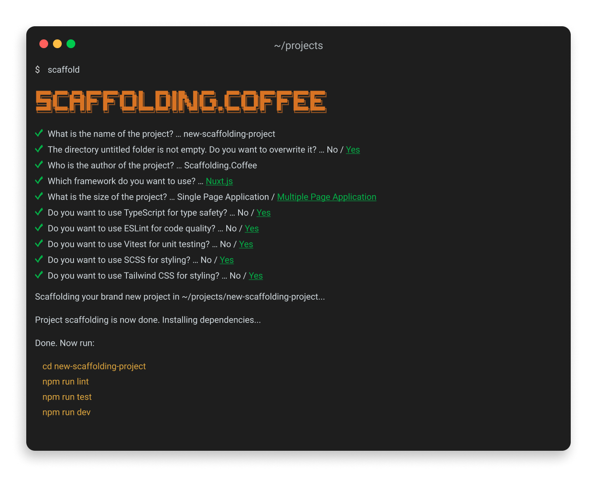

<p align="center">
   <a href="https://github.com/jp-coffee/scaffolding.coffee#readme" target="_blank" rel="noopener noreferrer">
      
   </a>
</p>

<p align="center">
   <a href="https://www.npmjs.com" target="_blank" rel="noopener noreferrer">
      
      <!--  -->
   </a>
   <a href="https://github.com/jp-coffee/scaffolding.coffee/actions/workflows/default.yml" target="_blank" rel="noopener noreferrer">
      
   </a>
   <a href="https://github.com/jp-coffee/scaffolding.coffee/issues" target="_blank" rel="noopener noreferrer">
      
   </a>
   <a href="https://www.npmjs.com/package/scaffolding.coffee" target="_blank" rel="noopener noreferrer">
      
      <!--  -->
   </a>
</p>

<br/>

Effortlessly create new projects with our JavaScript and TypeScript scaffolding CLI, designed to support the most popular frameworks. Our intuitive CLI streamlines the process, enabling you to generate new projects within seconds. Each project includes the best practices and essential tools needed for seamless development.

## Installation

To install Scaffolding.Coffee globally, run the following command:

```bash
npm install -g
```

To check that Scaffolding.Coffee has been installed correctly, run:

```bash
scaffold --version
```

<p align="center">
   
</p>

## Usage

The following commands are currently supported by Scaffolding.Coffee:

> All commands can be run with the `scaffold-` or `s-` alias.

- `scaffold-vue`: Setup a new Vue project (development)
- `scaffold-react`: Setup a new React project (roadmap)
- `scaffold-svelte`: Setup a new Svelte project (roadmap)
- `scaffold-vite`: Setup a new Vite project (roadmap)
- `scaffold-nuxt`: Setup a new Nuxt project (alpha)
- `scaffold-next`: Setup a new Next project (roadmap)
- `scaffold-sveltekit`: Setup a new SvelteKit project (roadmap)

## Documentation

The official documentation for Scaffolding.Coffee can be found at '[github/jp-coffee/scaffolding.coffee](https://github.com/jp-coffee/scaffolding.coffee#readme)'. The documentation covers how to use the CLI and all of the available commands and options.

## Roadmap

The Scaffolding.Coffee project has an exciting roadmap ahead! Here are some of the features we plan to add:

| Feature | Description | Status | Expected Release | Link to Issue |
| ------- | ----------- | ------ | ---------------- | ------------- |
| -       | -           | -      | -                | -             |

<!-- | Support for nuxt | Adding full support for nuxt project scaffolding, including the ability to scaffold a new nuxt project with a single command. |  | Q2 2023          | [](https://github.com/vitejs/vite/issues/1)  | -->
<!-- | Support for vue | Adding full support for vue project scaffolding, including the ability to scaffold a new vue project with a single command. |  | Q4 2023 | [](https://github.com/vitejs/vite/issues/2) | -->
<!-- | Example | This is an example |  | Example | [](https://github.com/vitejs/vite/issues/2) | -->

We welcome contributions from the community to help make these features a reality. Please see the [contributing guidelines](https://github.com/jp-coffee/scaffolding.coffee#readme) to learn how to get involved.

<!-- ## Contributors

[](https://github.com/JohnDoe)
[](https://github.com/JaneDoe)
[](https://github.com/MarkSmith) -->

## Contributing

If you are interested in contributing to Scaffolding.Coffee, please read our [contributing guidelines](https://github.com/jp-coffee/scaffolding.coffee#readme) to get started. Our guidelines cover everything from how to report a bug, to submitting a pull request. We welcome all contributions to the project and are grateful to all those who have already contributed.

## License

Scaffolding.Coffee is released under the [MIT License](https://opensource.org/licenses/MIT). The license covers all aspects of the project, including the CLI and any associated documentation.
